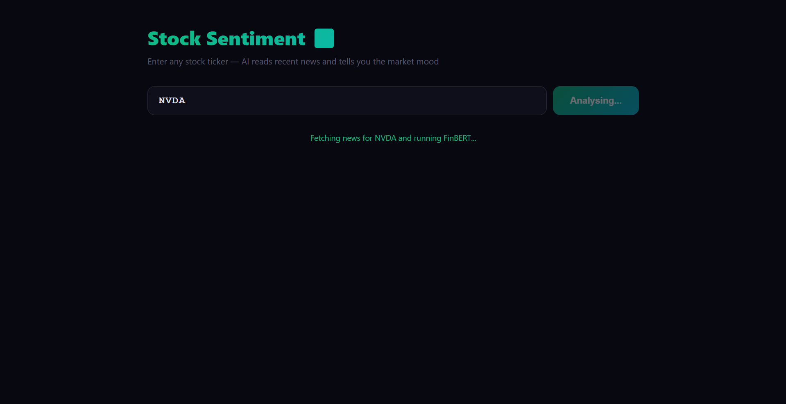
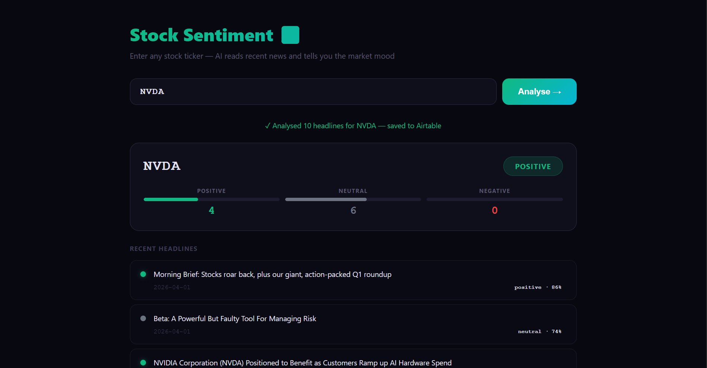

# Stock News Sentiment Analyser

> **Project 06** of my 30-Project AI Portfolio 
> An AI-powered pipeline that scrapes live stock headlines, analyses financial sentiment using FinBERT, stores results in Airtable, and displays them in a real-time web dashboard.

---

## Live Demo

Enter any stock ticker (AAPL, TSLA, NVDA...) and the app will:
1. Fetch the 10 most recent English news headlines
2. Run each headline through FinBERT a finance-trained sentiment model
3. Store all results in Airtable
4. Display a live sentiment dashboard with scores and colour-coded badges

---
## Screenshots

**Search Screen**


**Results Dashboard**


---

## How It Works

```
User enters ticker (e.g. NVDA)

NewsAPI fetches 10 recent headlines

HuggingFace FinBERT analyses each headline:
"Nvidia hits record revenue" positive (0.97)
"Chip export restrictions tighten" negative (0.84)
"Nvidia partners with Microsoft" positive (0.91)

Results stored in Airtable

Sentiment dashboard rendered in browser
```

---

## Tech Stack

| Layer | Technology |
|---|---|
| Web Framework | FastAPI |
| News Source | NewsAPI |
| Sentiment Model | HuggingFace FinBERT (ProsusAI/finbert) |
| Database | Airtable |
| Frontend | HTML / CSS / Vanilla JS |
| Environment | Python-dotenv |

---

## Project Structure

```
stock-sentiment-analyser/
main.py # FastAPI app routes, pipeline orchestration
scraper.py # Fetches headlines from NewsAPI
sentiment.py # Calls HuggingFace FinBERT API
airtable_client.py # Stores results in Airtable
templates/
index.html # Frontend dashboard
.env.example # Environment variable template
requirements.txt # Python dependencies
README.md
```

---

## Setup & Installation

### 1. Clone the repository

```bash
git clone https://github.com/YOUR_USERNAME/stock-sentiment-analyser.git
cd stock-sentiment-analyser
```

### 2. Create a virtual environment

```bash
python -m venv venv
source venv/bin/activate # Mac/Linux
venv\Scripts\activate # Windows
```

### 3. Install dependencies

```bash
pip install -r requirements.txt
```

### 4. Set up environment variables

Create a `.env` file in the root directory:

```env
NEWSAPI_KEY=your_newsapi_key_here
HUGGINGFACE_API_KEY=hf_your_token_here
AIRTABLE_API_KEY=pat_your_token_here
AIRTABLE_BASE_ID=appXXXXXXXXXXXXXX
AIRTABLE_TABLE_NAME=Headlines
```

| Variable | Where to get it |
|---|---|
| `NEWSAPI_KEY` | [newsapi.org](https://newsapi.org) free account |
| `HUGGINGFACE_API_KEY` | [huggingface.co/settings/tokens](https://huggingface.co/settings/tokens) Write token |
| `AIRTABLE_API_KEY` | [airtable.com/create/tokens](https://airtable.com/create/tokens) |
| `AIRTABLE_BASE_ID` | From your Airtable base URL: `airtable.com/appXXXX/...` |

### 5. Set up Airtable

Create a base named `StockSentiment` with a table named `Headlines` and these fields:

| Field Name | Type |
|---|---|
| Ticker | Single line text |
| Headline | Long text |
| Sentiment | Single line text |
| Score | Number |
| FetchedAt | Single line text |

### 6. Run the app

```bash
uvicorn main:app --reload
```

Open your browser at: [http://127.0.0.1:8000](http://127.0.0.1:8000)

---

## Requirements

```
fastapi
uvicorn
requests
beautifulsoup4
pyairtable
python-dotenv
pydantic
```

Generate `requirements.txt`:

```bash
pip freeze > requirements.txt
```

---

## API Endpoints

| Method | Endpoint | Description |
|---|---|---|
| GET | `/` | Serves the dashboard UI |
| POST | `/analyse` | Accepts `{ ticker }` runs full pipeline |
| GET | `/history/{ticker}` | Returns all stored records for a ticker |
| GET | `/tickers` | Returns list of all tickers analysed |

---

## About FinBERT

FinBERT is a BERT-based model pre-trained on financial news and fine-tuned for sentiment analysis. Unlike general sentiment models, it understands financial language:

- *"Fed raises rates"* **negative** (bad for markets)
- *"Company beats earnings"* **positive**
- *"Markets remain flat"* **neutral**

Model used: [`ProsusAI/finbert`](https://huggingface.co/ProsusAI/finbert)

---

## Example Output

```json
{
"ticker": "NVDA",
"total": 10,
"overall": "positive",
"counts": { "positive": 6, "negative": 2, "neutral": 2 },
"results": [
{ "headline": "Nvidia posts record quarterly revenue", "sentiment": "positive", "score": 0.97 },
{ "headline": "Chip export restrictions tighten", "sentiment": "negative", "score": 0.84 }
]
}
```

---

## Part of My AI Portfolio

This is **Project 06** in my 30-project AI portfolio, progressing through:

| Phase | Projects | Focus |
|---|---|---|
| Phase 1 | 0104 | Memory, CRUD, Vision, Scraping |
| Phase 2 | 0508 | RAG, Sentiment, Agents, Voice |
| Phase 3 | 0912 | Fine-tuning, Embeddings, Search |
| Phase 4 | 1320 | Production, APIs, Deployment |
| Phase 5 | 2126 | Advanced AI Systems |
| Phase 6 | 2730 | Capstone Projects |

---


*Built with FastAPI + HuggingFace FinBERT + Airtable*